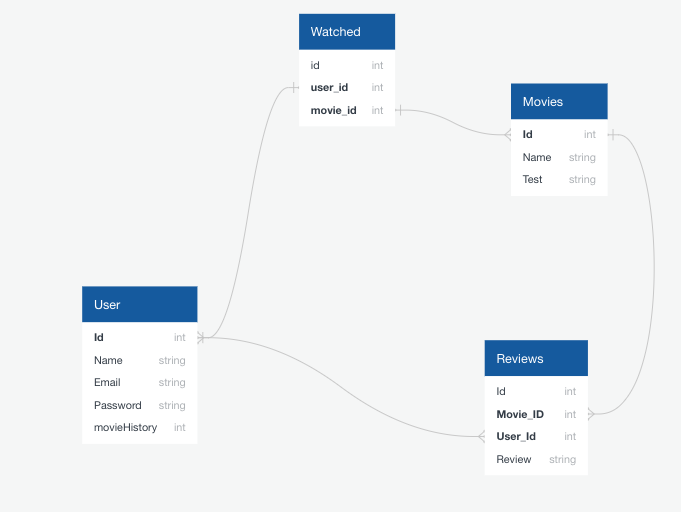
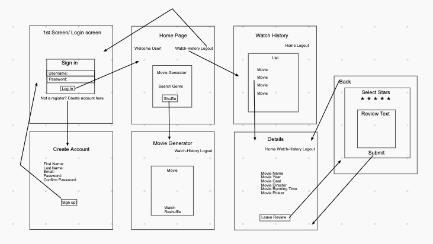

# Movie-App
Get movie suggestions, add movies to you watch list
## Steps to install on local computer
1. Go to [repo](https://github.com/AJStrizzy/movie-app) on Github profile
2. `fork` and `clone` repo
3. Clone to local machine
```text
git clone https://github.com/AJStrizzy/movie-app.git
```
4. Go to `movie-app` directory
5. Run
```text
nodemon app.js
```
in your terminal.

5. Go to `localhost:3000` in your browser

```text
This was my second project done during my software engineering course with General Assembly. This project was done during
the duration of the 7th week of the course. During the 5th and 6th weeks of the course we learned about how to use Node, Express and using dependencies. This project was our attempt at putting together an app
with several different routes, using GET, POST, PUT and DELETE.

The idea for my app was to make a movie recommender that provides movie suggestions based on genre choice. Once a movie is recommended the user can choose to either add the movie to their watch list, or get a new suggestion. Once movies are added to the watch list the user can they go and leave a review for that movie, and subsequently see a list of all the reviews they made. The user can also remove movies from their watch list witch also deletes any review they made for that movie.

This app required a databe to store information in 3 different models.
One model would store the user information, one would store the movie information, and the last model would join the user and movie models together as well as have a column for the actual movie reviews. Initially I intended on having four tables but it did not turn out to be necessary. This was the initial sketch of the database setup.
```





```text
I also had to map out how each webpage would link to eachother. I created a flowchart that really helped keep me organized as I set up all the routes. This is what the initial flow chart looked like
```



Here are some code snippets that built the foundation of the app.


```javascript
app.get('/', (req, res) => {
    res.render('login', { alerts: res.locals.alerts, title: 'Movie Generator: Login', loggedIn: !!req.user})
})
app.get('/profile', (req, res) => {
  db.user.findAll({
        where: {
          id: req.user.id
          }
      }).then((userInfo) => {
    res.render('profile', { title: 'Movie Generator: profile', loggedIn: !!req.user, userInfo})
  })
})
app.get('/home', isLoggedIn, (req, res) => {
    res.render('home', { title: 'Movie Generator: Home', loggedIn: !!req.user})
})
app.get('/signup', (req, res) => {
    res.render('signup', { title: 'Movie Generator: Signup', loggedIn: !!req.user})
})

app.get('/movie', (req, res) => {
    const genres = {
        action: '28', adventure: '12', animation: '16', comedy: '35', crime: '80', documentary: '99',
        drama: '18', family: '10751', fantasy: '14', history: '36', horror: '27', mystery: '9648',
        romance: '10749', thriller: '53'
    }
    const searchTerm = req.query.name

    axios.get(
        `https://api.themoviedb.org/3/discover/movie?api_key=${process.env.API_KEY}&language=en-US&sort_by=popularity.desc&include_adult=true&include_video=false&page=1&with_genres=${genres[searchTerm]}`)
        .then((response) => {
            res.render('movie', { title: 'Movie Generator: Movie Choice', movies: response.data.results, loggedIn: !!req.user })
        }).catch((err) => {
            console.log(err)
        })
})
app.get('/history', (req, res) => {
  db.review.findAll({
      where: {
        userId: req.user.id
      },
      include: [
        db.movie
      ]
    }).then((arrReview) => {
      res.render('history', { title: 'Movie Generator: Watch History', arrReview, loggedIn: !!req.user})
    })
  })

  app.post('/history', (req, res) => {
    db.movie.findOrCreate({
      where: {
        title: req.body.title,
        poster: req.body.poster
      }
    }).then(([movie, created]) => {
      db.review.findOrCreate({
        where: {
          userId: req.user.id,
          movieId: movie.id
        }
      }).then(()=> {
        res.redirect('/history')
      })   
    })    
  })


  app.post('/history/delete', (req, res) => {
    db.movie.destroy({
        where: {
          title: req.body.title,
        },
      }).then(() => {
        db.review.destroy({
          where: {
            movieId: req.body.id
          }
        })
        res.redirect('/history')
      })
    })

app.get('/review', (req, res) => {
  db.review.findAll({
    where: {
      userId: req.user.id,
      review: {[op.not]: null}
      },
      include: [
        db.movie
      ]
  }).then((reviewInfo) => {
    res.render('review', { title: 'Movie Generator: Movie Details', loggedIn: !!req.user, reviewInfo})
  })    
})

app.get('/reviewPage', (req, res) => {
  
  db.review.findAll({
    where: {
      userId: req.user.id,
      movieId: req.query.id
    },
    include: [
      db.movie
    ]
      }).then((reviewInfo) => {
        console.log(reviewInfo)
  res.render('reviewPage', { title: 'Movie Generator: Movie Details', loggedIn: !!req.user, reviewInfo})
  }) 
}) 

app.put('/reviewPage', (req, res) => {
  db.review.findOne({
    where: {
      userId: req.body.user,
      movieId: req.body.movie
    },
  }).then((review)=> {
    review.review = req.body.review
    review.save().then((review) => {
      res.redirect('/review')
    })
  })
})
```
```text
This is the code that sets up all of the different routes in the app. It also sets up the authentication process for logging in.
```

```javascript
app.get('/movie', (req, res) => {
    const genres = {
        action: '28', adventure: '12', animation: '16', comedy: '35', crime: '80', documentary: '99',
        drama: '18', family: '10751', fantasy: '14', history: '36', horror: '27', mystery: '9648',
        romance: '10749', thriller: '53'
    }
    const searchTerm = req.query.name

    axios.get(
        `https://api.themoviedb.org/3/discover/movie?api_key=${process.env.API_KEY}&language=en-US&sort_by=popularity.desc&include_adult=true&include_video=false&page=1&with_genres=${genres[searchTerm]}`)
        .then((response) => {
            res.render('movie', { title: 'Movie Generator: Movie Choice', movies: response.data.results, loggedIn: !!req.user })
        }).catch((err) => {
            console.log(err)
        })
})
```
```text
This route really powers the whole app, it's where all the movie information is fetched from [themoviedb.org](https://themoviedb.org) and then stored in the appropriate models. This route also store an object with allows the user to type in the genre they want and have the numerical value be placed in the url as a search term. This had to be done because [themoviedb.org](https://themoviedb.org) doesn't search by genre name, but by unique ID values given to each genre.
```

```html
     <link rel="stylesheet" href="/styleLayout.css">
    </head>
    <body>
        <%- include('alerts') %>
        <nav class="nav">
            <ul class="navList">
                <h2 class="left">The Movie Database</h2>
                <% if (loggedIn) { %>
                <li><a href="/logout">Logout</a></li>
                <li><a href="/review">Your Reviews</a></li>
                <li><a href="/history">Watch History</a></li>
                <li><a href="/home">Home</a></li>
                <li><a href="/profile">Profile</a></li>
                <% } %>
            </ul>
        </nav>
        

        <%-body %> 

        <h3>Copyright &copy Moviegen 2020</h3>
```
```text
This is the html code for the layout page which provides a basis for how each page will appear in the app. There is an if statement being used to identify when the nav bar will be shown, depending on whether a user is logged in or not.
```

    
